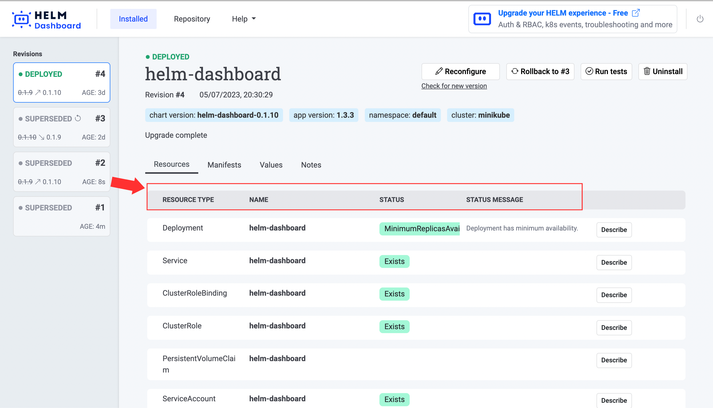
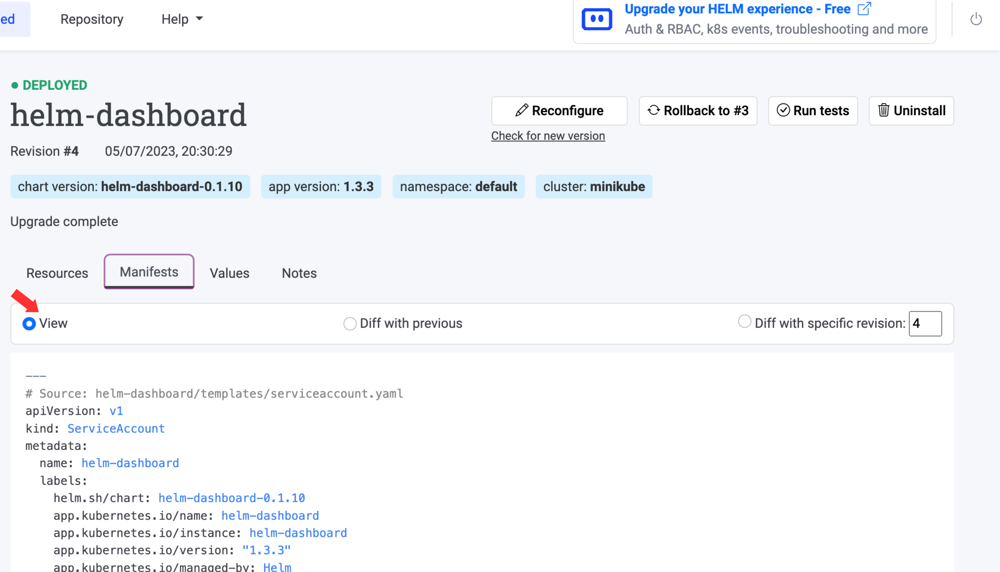
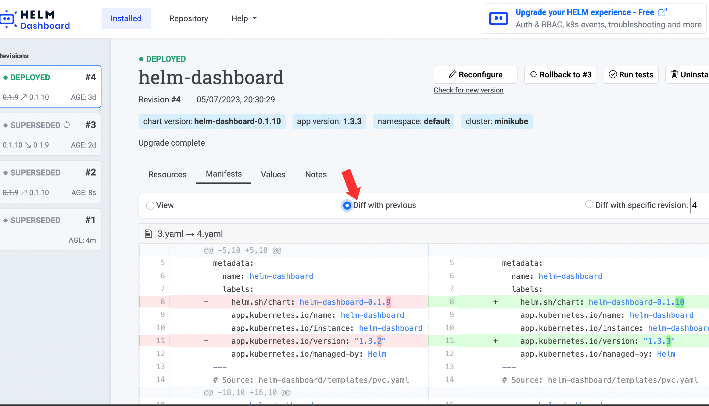
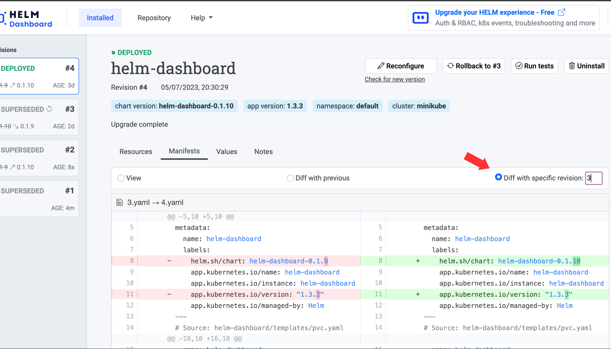
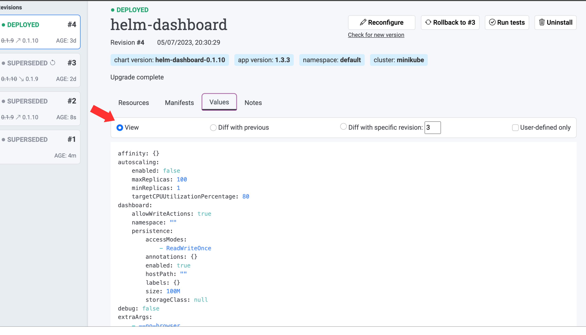
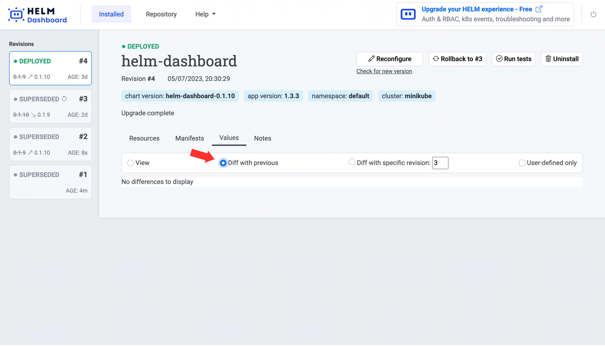
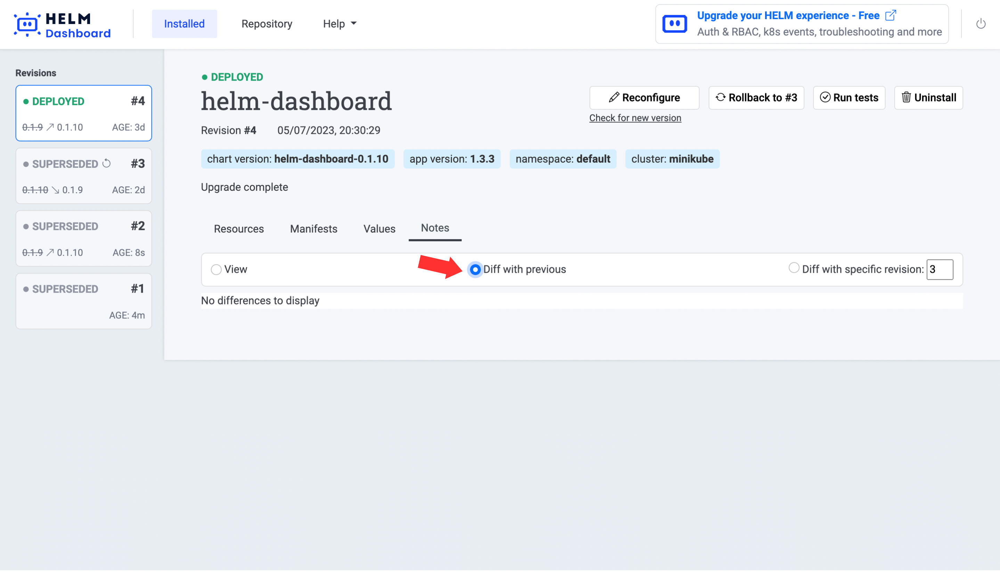

# Shutting down the app
To close Helm-dashboard, click on the button in the rightmost corner of the screen. Once you click on it, your Helm-dashboard will be shut down.

# Multicluster
If you want to switch to a different cluster, simply click on the corresponding cluster as shown in the figure. [Click here](https://kubernetes.io/docs/tasks/access-application-cluster/configure-access-multiple-clusters/) to learn how to access multiple clusters.

# Reset Cache
The "Reset Cache" feature in Helm Dashboard clears the cached data and fetches the latest information from the backend or data source. It ensures that the dashboard displays up-to-date data and reflects any recent changes or updates.

# Repository
Essentially, a repository is a location where charts are gathered and can be shared. If you want to learn more about repositories, [click here](https://helm.sh/docs/topics/chart_repository/). You can find the repository in the home section, as depicted in the figure.

You can add the repository by clicking on 'Add Repository', as shown in the figure.

After completing that step, enter the following data: the repository name and its URL. You can also add the username and password, although this is optional.

Updating means refreshing your repository. You can update your repository as shown in the figure.

If you want to remove your repository from the Helm dashboard, click on the 'Remove' button as shown in the figure.

Use the filter option to find the desired chart quicker from the list of charts.

If you want to install a particular chart, simply hover the pointer over the chart name and an 'Install' button will appear, as shown in the figure.

# Installed Releases list
A release is an instance of your selected chart running on your Kubernetes Cluster. That means every time that you install a Helm chart there, it creates a new release or instance that coexists with other releases without conflict. You can filter releases based on namespaces or search for release names 

The squares represent k8s resources installed by the release. Hover over each square to view a tooltip with details. Yellow indicates "pending," green signifies a healthy state, and red indicates an unhealthy state.

It indicates the version of chart that corresponds to this release.

A revision is linked to a release to track the number of updates/changes that release encounters.

 
Namespaces are a way to organize clusters into virtual sub-clusters — they can be helpful when different teams or projects share a Kubernetes cluster. Any number of namespaces are supported within a cluster, each logically separated from others but with the ability to communicate with each other.

Updated" refers to the amount of time that has passed since the last revision of the release. Whenever you install or upgrade the release, a new revision is created. You can think of it as the "age" of the latest revision.

Indication of upgrade possible/repo suggested.

# Release details
This indicates the status of the deployed release, and 'Age' represents the amount of time that has passed since the creation of the revision until now.

You can use the Upgrade/Downgrade button to switch to different release versions, as shown in the figure.

Confirm the upgrade settings and configuration and click on confirm button to continue

Once the upgrade is done, your release will show the status 

It executes the test scripts or commands within the deployed application's environment and displays the results

Running test hooks results 

The Helm Dashboard provides basic information about your Helm releases, including revision number, deployment date, release message, cluster details, and deployment status.

### Resource Tab

In the Resources tab of the Helm Dashboard, you can view the kind (type), name, status, and any associated messages for your Kubernetes resources.

### Manifest Tab

Text: The Manifests tab displays the textual representation of the Kubernetes manifests associated with your Helm release. It provides the YAML or JSON configuration files that define the desired state of the resources deployed in your cluster.

Diff with Previous: The "Diff with Previous" feature allows you to compare the current version of the manifests with the previous version. It highlights the differences between the two versions, making it easier to identify the changes made in the deployment.

Diff with Specific: The "Diff with Specific" option enables you to compare the current version of the manifests with a specific past version. It allows you to select a particular revision and view the differences between that revision and the current one.

### Values Tab

Text: The Values tab displays the textual representation of the values file associated with your Helm chart. It shows the YAML or JSON file that contains the configuration values used during the deployment of the chart.

Diff: The "Diff" feature allows you to compare the current values with the previous values used in a previous deployment. It highlights any differences between the two versions, making it easier to identify changes made to the configuration.

### text Tab

Text: The Notes tab displays any accompanying notes or documentation related to the Helm chart.

Diff with previous: The "Diff" feature is not typically available in the Notes tab. This tab is primarily meant for viewing the static text-based notes associated with the chart and doesn't involve comparisons or tracking changes like in the Manifests or Values tabs.

Diff with Specific Version: Similar to the previous point, the ability to view a diff with a specific version of the notes is not a standard feature in the Notes section of the Helm Dashboard. The Notes section usually presents the information for the specific version of the Helm chart that is currently deployed.

